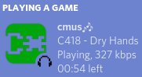

# cmus discord rich presence (dbus edition)

## how to use
install all requirements (discoIPC, pydbus)  
make sure cmus and discord are running  
python3 a.py

## extra stuff
make sure you're using my cmus fork if u want more Gamer Features  
[icon from here](https://ryuutei.wordpress.com/2013/02/17/cmus-icon/)

## preview

